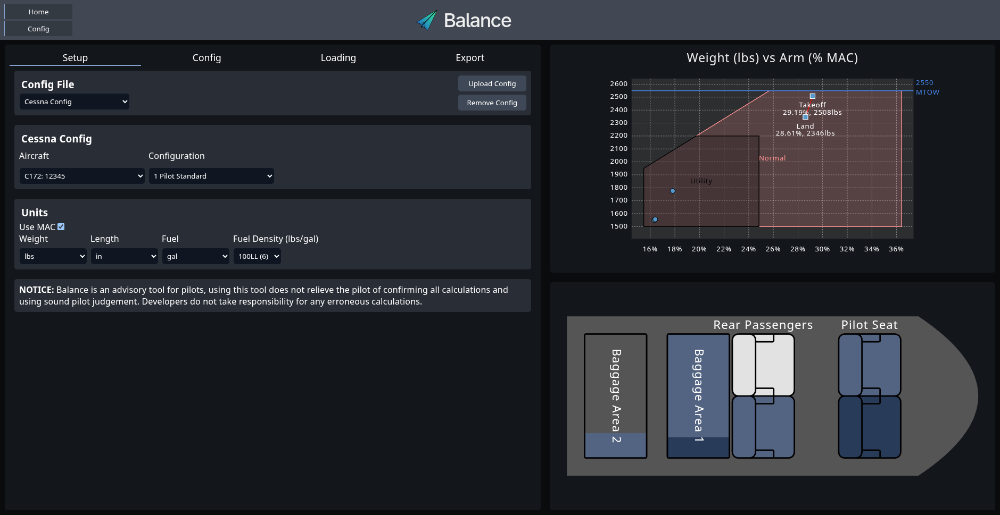
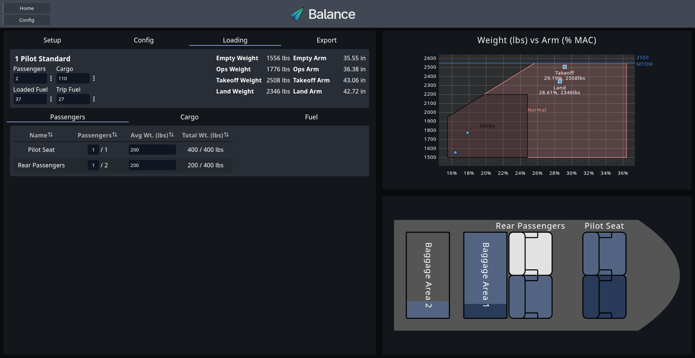
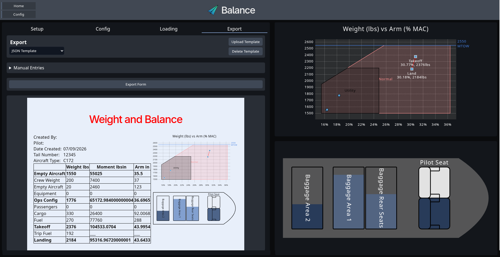

# Balance

<picture>
  
</picture>

> [!NOTE]
> Developers of Balance do not take any responsibility for incorrect calculations
> that may lead to exceeding aircraft limitations. Using this planning tool designed
> not substitute sound pilot judgement, confirm all calculations with your
> aircraft POH.

> [!WARNING]
> This is in early development, it is not guaranteed if any that configuration
> files will work in future versions.

Balance is a tool to help pilots calculate their aircraft's weight and balance.
This is designed to allow users or organizations to create configuration files
for their aircraft and share that with anyone flying their aircraft.

### Setup page



### Loading Page



### Export Page



Features include:

- Quick-load passengers/cargo
- Prioritized fuel tanks
- Offline capability
- User defined pdf export
- Plain text configuration files
- Multiple units
- Separated operations loadout

## Use

You can use Balance now at [here](https://www.av-tac.com). It is also available as a PWA for [install](https://developer.mozilla.org/en-US/docs/Web/Progressive_web_apps/Guides/Installing) and offline use.

### Configurations

Configuration files contain all information about the aircraft in terms of weight
and balance. They can have multiple aircraft of varying types and includes all
seats and cargo locations, possible equipment, aircraft layouts, fuel tanks (fixed
or removable), balance envelopes, and weight limits.

The configuration file can be edited in [Balance Config](https://www.av-tac.com/config).
For further information checkout the docs on using the config builder are coming soon.

## Building

The app is built using a Vite build environment with React typescript.

> [!NOTE]
> `npm` is a prerequisite for building the project.

Download the code to your computer and navigate to that folder. Install the npm
packages and build.

``` bash
$ npm i
$ npm run build
```

This will create a `dist` directory where the build will be. This can be copied
to be used in a webserver or a python http server can be run for local access.

To run the python http server:
``` bash
$ python -m http.server 8000
```

In your browser navigate to `localhost:8000`.

Alternatively, you can run the development version using the `run` command.

``` bash
$ npm run dev
```

## Development

This is early development and there will be lots of changes coming. Open an Issue
if you have any ideas how to improve the UI, usability, accessibility, or function.
Code cleanup will also be welcomed.

### Priority Tasks

- [ ] Mobile device accessibility
- [ ] Security of export
- [ ] Optimize export page loading
- [ ] Provide way to share configurations/templates

